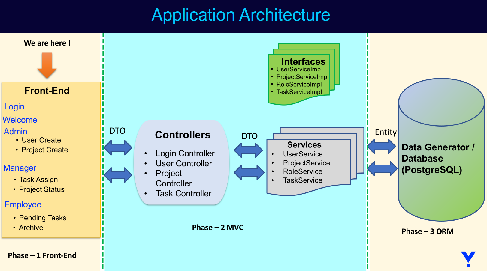
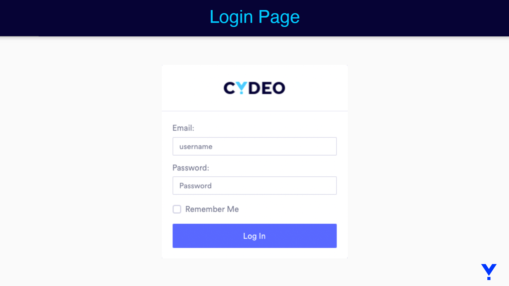
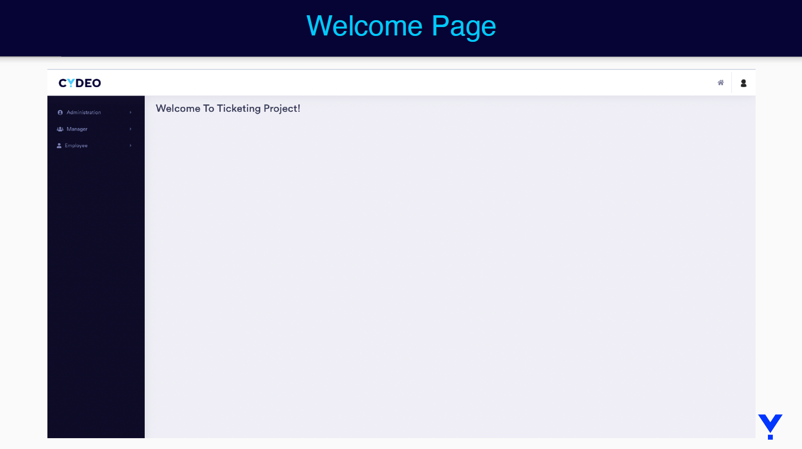
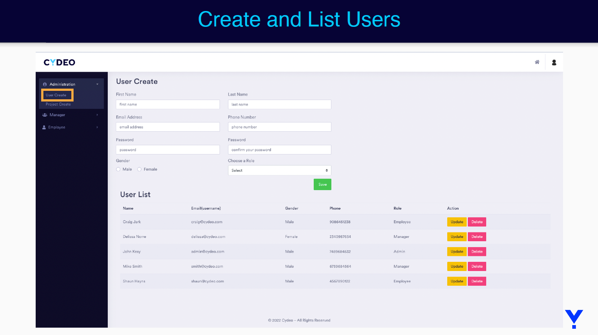
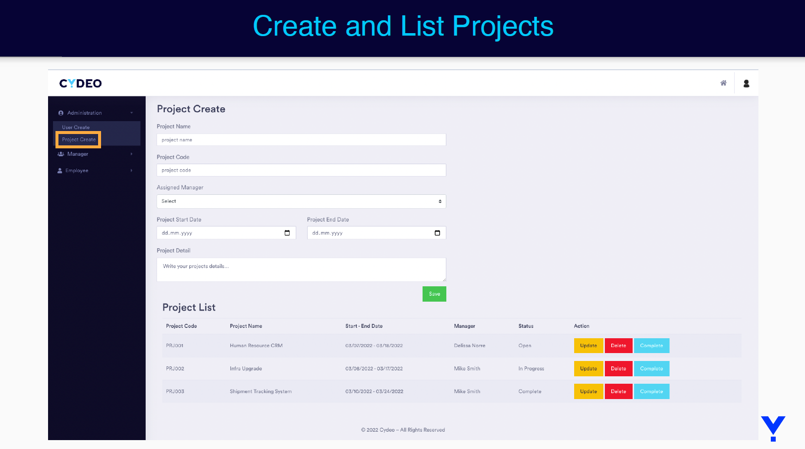
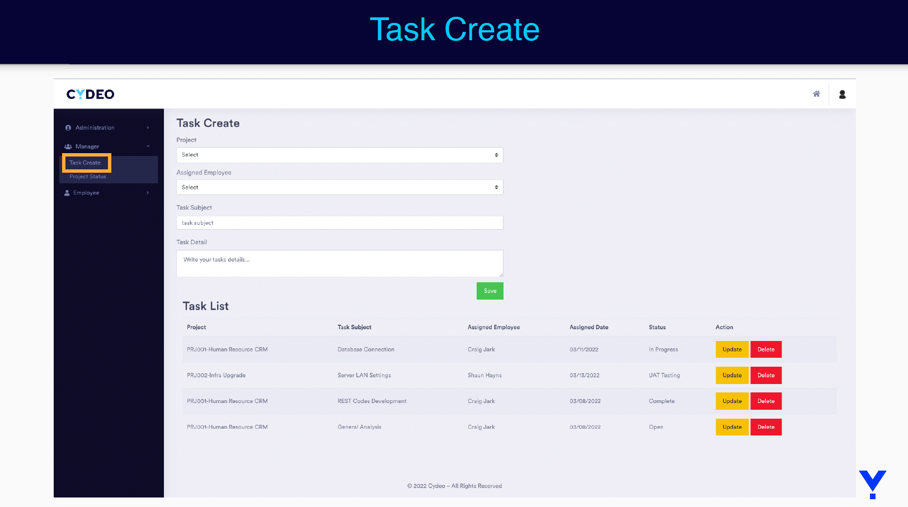
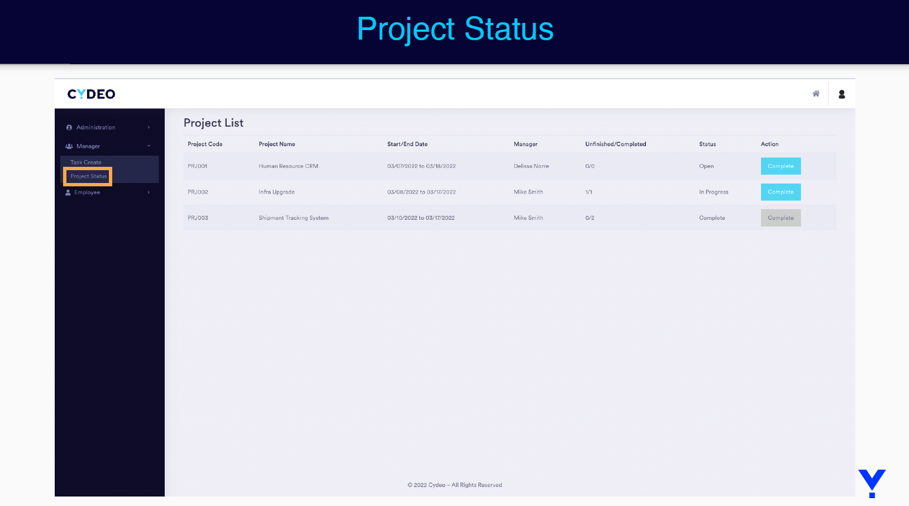
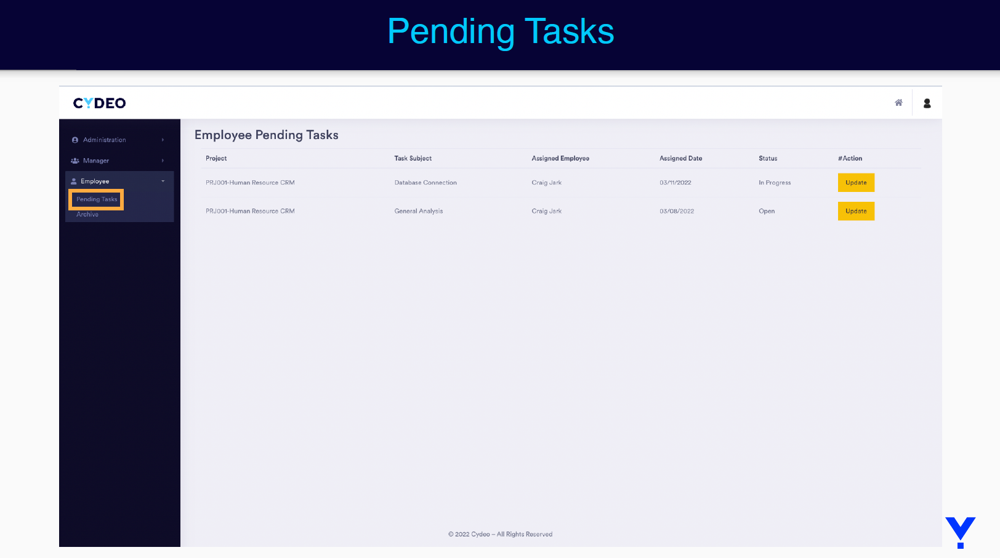
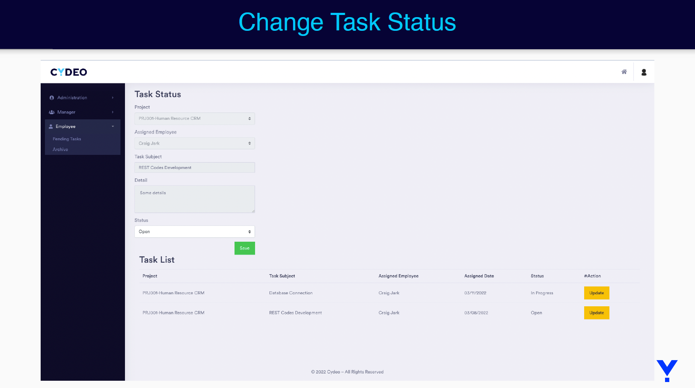

# CYDEO Ticketing Project Initial Template

Project Definition

• A ticketing project is an application that organizes management processes.

• The application will allow client to create and manage users, projects and tasks.

Requirements

Features that are developing on the project are:

• User management:

• CRUD operations for users.

• Authentication of users. After we login, we will redirect users to the welcome page.

• The user will have a role assigned for it. Provided roles will be ADMIN, MANAGER,
EMPLOYEE.

1. ADMIN will be able to create and manage users.
2. MANAGER will be able to use all the parts related to projects such as creating a
   project, assigning a task to an employee, etc.
3. EMPLOYEE will be able to see all tasks related to him, and change the statuses of
   their assigned tasks.

Project

• CRUD operations for the project.

• Every project created will have a manager responsible for it. When creating a project you must assign a manager.

• The project will be able to have status. Provided statuses for project will be OPEN,
IN_PROGRESS, UAT_TEST, COMPLETE.

• The manager of the project will be able to create tasks for employees.

• The manager will be able to complete the project.

Task

• CRUD operations for the task.

• Every task created will have an employee responsible for it.

• When a task is created by the manager, it will be assigned to an employee.

• The task will be able to have status. Provided statuses for task will be OPEN,
IN_PROGRESS, UAT_TEST, COMPLETE.

• Employees will be able to change the status of the task depending on which phase it is.

• Employees will be able to see their own tasks and to start working on it.

• Employees will be able to see all of their archived tasks.

